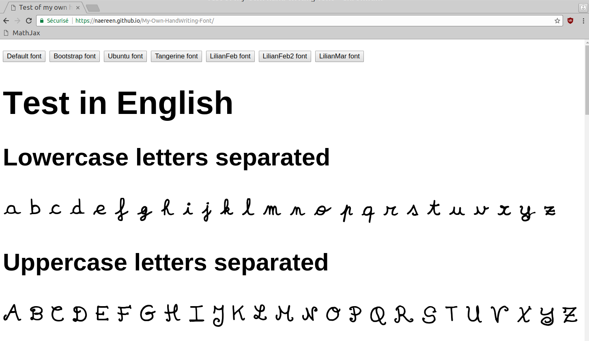

# My own hand-writing font

> See the demo, [here](https://naereen.github.io/My-Own-HandWriting-Font/).

> This example shows this font, [`LilianMar-Regular.ttf`](css/fonts/LilianMar-Regular.ttf) (see also in other formats, [`LilianMar-Regular.woff`](css/fonts/LilianMar-Regular.woff), and [`LilianMar-Regular.otf`](css/fonts/LilianMar-Regular.otf)).

## How?
- I have tried [Calligraphr](https://www.calligraphr.com/en/webapp/), only the free plan. See [the FAQ](https://www.calligraphr.com/en/docs/faq/#faq-common-problems) if needed. It gave this font [`LilianFeb-Regular.ttf`](css/fonts/LilianFeb-Regular.ttf)
- But I didn't want to pay a license for Calligraphr, and I wanted to build/hack on my own tool.
- So I rescued the dead open-source project [Fontify](https://github.com/fontify/fontify/), now hosted at [https://github.com/Naereen/fontify/](https://github.com/Naereen/fontify/). Before working on it, it gave this font, [`LilianFeb2-Regular.ttf`](css/fonts/LilianFeb2-Regular.ttf), and now after improving all what I wanted to do, it gave [`LilianMar-Regular.ttf`](css/fonts/LilianMar-Regular.ttf) (see in the webpage for a demo).

## Other examples
- See [this discussion](https://github.com/Naereen/slides/issues/6#issuecomment-370741926) explaining how to use a custom font for only a part of a Beamer-LaTeX slides document.
- See [this example](https://perso.crans.org/besson/publis/latex/test_handwritten_font_with_fontify.pdf) showing a complete demo of using a custom font in a LaTeX document.

---

### :scroll: License ? 
This (small) repository are published under the terms of the [MIT license](http://lbesson.mit-license.org/) (file [LICENSE](LICENSE)).
© [Lilian Besson](https://GitHub.com/Naereen), 2018.

